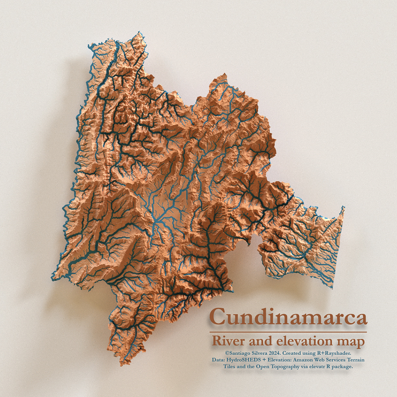

# Elevation map and rivers in Cundinamarca, Colombia

The associated R script created by Santiago Silvera, were produced as part of an independent consulting study in 2024, which aimed to determine the optimal railway route connecting Bogotá and the Magdalena River in Colombia. The elevation data was processed by an algorithm to navigate the ~2,200-meter descent between the two locations while adhering to strict constraints for slope, height, and track radius. The map result of this script was for illustrative purposes only.

In subsequent steps not included in this script, the optimal path finding algorithm used the elevation data to accomplish its purpose.

## 🚀 How use this script

It's recommended to install the `pacman` package, which installs the libraries needed to run the script. All step-by-step details are included as comments within the code.

Have fun!

## 🛠️ Technologies used ##
R: Versión 4.3.3
RStudio Version 2025.05.0
Paquetes de R: 'pacman', 'sf', 'terra', 'elevatr', 'geodata', 'rayshader', 'rayrender', 'magick', 'glue' and 'tidyverse'.

©2024. Santiago Silvera. Berlin, Germany.
